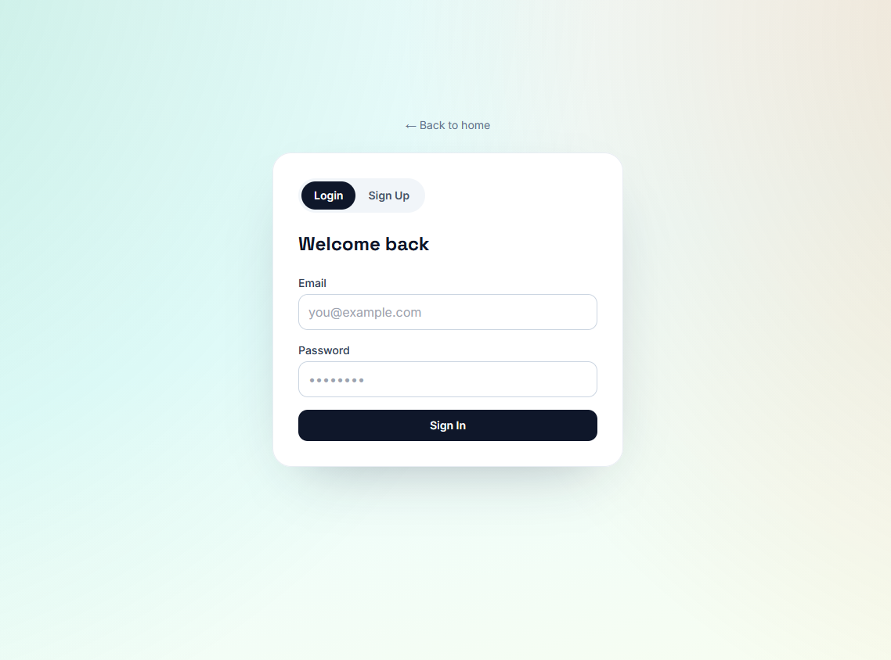

# webml — Full-Stack Web App + MLOps Platform

A personal portfolio site backed by a production-grade(!) auth microservice: React + FastAPI + PostgreSQL + Redis + RabbitMQ + NGINX, deployed on Kubernetes (Kind) or Docker Compose.


## Quick Summary!!!

This is a web application with authentication that has alembic, rabbitmq logging, key rotation jwks, public key caching inside redis,docker user perms isolation, postgre for user credentials.
Kind for cluster management (with the kubernetes version), docker-compose.yml for the normal version, nginx reverse proxy serving static files. Docker internal bridge network, login page, a page that has a snake game, i liked the hw, so i did a little more then expected.

The envs are in docker as its just a in dev web application not intended for prod

you can just docker-compose up -d --build for easy test

## Important!!!
- Dockerfiles are under src/

- 2 versions with and without kubernetes

- I also used ai a bit but because i already had the project structure in mind its just a tool as i have done similar projects like this without ai





## Run it (Docker Compose)

The compose stack now bundles the ML lifecycle alongside the web app: Postgres, Redis, RabbitMQ, backend, frontend, NGINX, **MLflow tracking server (Postgres-backed)**, and the **ml-service** prediction API. Everything builds + comes up with a single command — migrations + the postgres `mlflow` database init script + JWKS bootstrap all run automatically:

```bash
docker compose up -d --build
```

| URL | What |
|-----|------|
| http://localhost:8080 | App (portfolio + auth + property valuation) |
| http://localhost:8080/api/docs | Backend Swagger UI |
| http://localhost:5000 | MLflow tracking UI + Model Registry |
| http://localhost:5002/docs | Prediction API Swagger |
| http://localhost:15672 | RabbitMQ UI (guest / guest) |

Stop and wipe state (including the `mlflow` DB and artifact volume):

```bash
docker compose down -v
```

---

## Run it (Kubernetes / Kind)

> Stop Compose first: `docker compose down`

A `Makefile` at the repo root wraps the whole flow — building the four images, loading them into Kind, applying the Kustomize tree, and waiting for every Deployment to be Ready:

```bash
# One-time — installs kubectl + kind if missing (uses sudo on Linux/macOS)
make tools

# Create cluster + build + load + apply + rollout (≈3-5 min cold)
make kind-up

# Port-forward the gateway to your laptop
make fwd
#   → http://127.0.0.1:8080
```

What `kind-up` does under the hood, for reference:

| Step | Command |
|---|---|
| Cluster | `kind create cluster --name webml --config k8s/kind-config.yaml` |
| Images | `docker build` for `backend`, `frontend`, `mlflow`, `ml-service` |
| Load   | `kind load docker-image --name webml …` |
| Apply  | `kubectl apply -k k8s/` |
| Wait   | `kubectl -n webml rollout status deployment/…` |

After editing code, do an inner-loop rebuild + rollout in one shot:

```bash
make kind-reload                                 # all four images
make image-mlflow && kubectl -n webml rollout restart deployment/mlflow   # just one
```

Tear down:

```bash
make kind-down
```

### Train + deploy a model into the running cluster

`scripts/train_and_deploy.py` (cross-platform, no shell-isms) opens a port-forward to MLflow, trains, promotes the new version to `@champion`, and hot-reloads the ml-service pods:

```bash
make deploy-model                                # train + promote latest + hot-reload
make deploy-model ARGS="--skip-train"            # promote latest existing version + reload
make deploy-model ARGS="--version 3 --restart"   # pick a specific version, use rollout-restart
```

The raw CT real-estate CSV must be in `ml_service/data/raw/` first — see `ml_service/README.md` § *Get the Dataset*.

---

## Inspect the databases / MLflow

Run each in a separate terminal, then connect with any local client:

```bash
# Postgres — connect with psql or any DB client at localhost:5432
kubectl port-forward -n webml svc/postgres 5432:5432

# Redis — connect with redis-cli or RedisInsight at localhost:6379
kubectl port-forward -n webml svc/redis 6379:6379

# RabbitMQ management UI — open http://localhost:15672 (guest / guest)
kubectl port-forward -n webml svc/rabbitmq 15672:15672

# MLflow UI + Model Registry — open http://localhost:5000
kubectl port-forward -n webml svc/mlflow 5000:5000
```

---

## API

### Auth

| Method | Path | Auth | Description |
|--------|------|------|-------------|
| GET | `/health` | — | Health check |
| POST | `/api/v1/auth/register` | — | Create account |
| POST | `/api/v1/auth/login` | — | Login, returns JWT pair |
| POST | `/api/v1/auth/refresh` | Refresh cookie (or body) | Rotate refresh token |
| GET  | `/api/v1/auth/check` | Access cookie | 200 if session valid, 401 otherwise |
| GET | `/api/v1/auth/jwks` | — | Public JWKS keys |

### Game

| Method | Path | Auth | Description |
|--------|------|------|-------------|
| POST | `/api/v1/game/scores` | Bearer JWT | Save a Snake game score |
| GET | `/api/v1/game/scores/leaderboard` | — | Top scores (public) |

### Property valuation (ML)

| Method | Path | Auth | Description |
|--------|------|------|-------------|
| POST | `/api/v1/prediction/predict` | Bearer JWT | Single-transaction sale-price estimate |
| POST | `/api/v1/prediction/predict/batch` | Bearer JWT | Batch predictions |

Quick test:
```bash
curl -s -X POST http://localhost:8080/api/v1/auth/register \
  -H "Content-Type: application/json" \
  -d '{"username":"alice","email":"alice@example.com","password":"ChangeMe123!"}'
```
